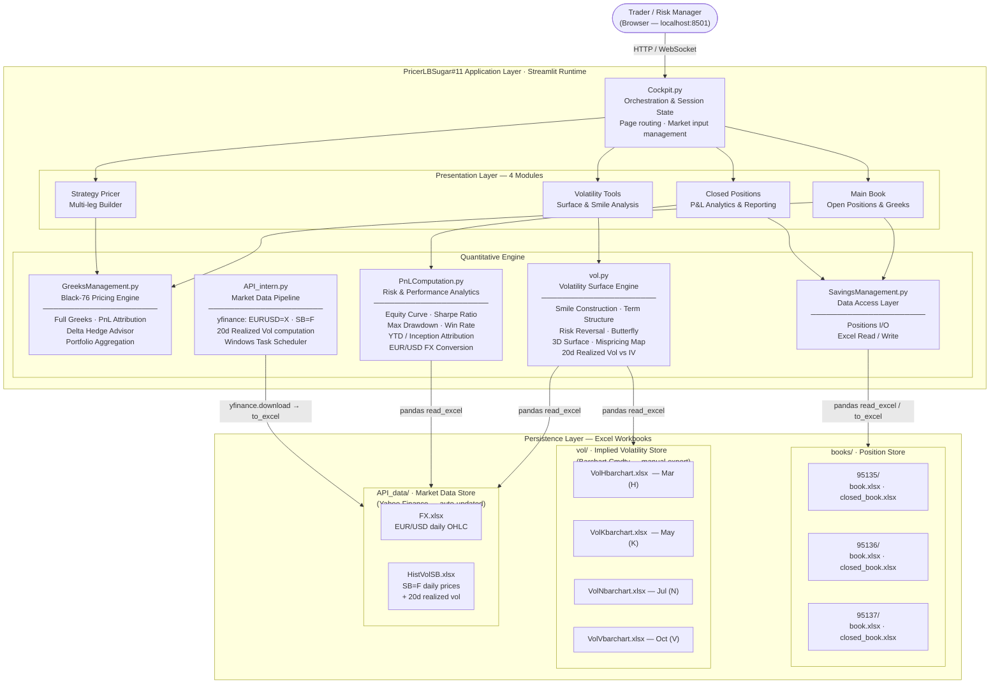
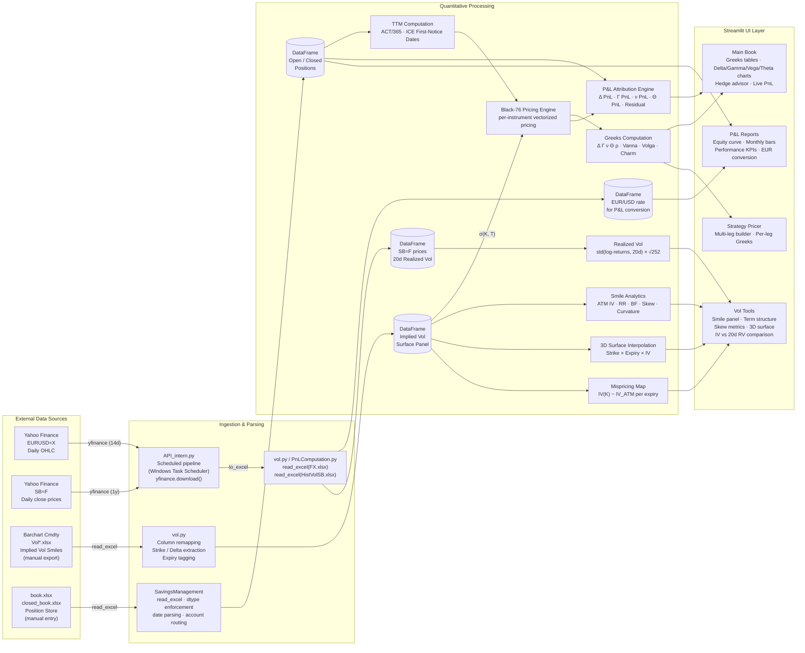
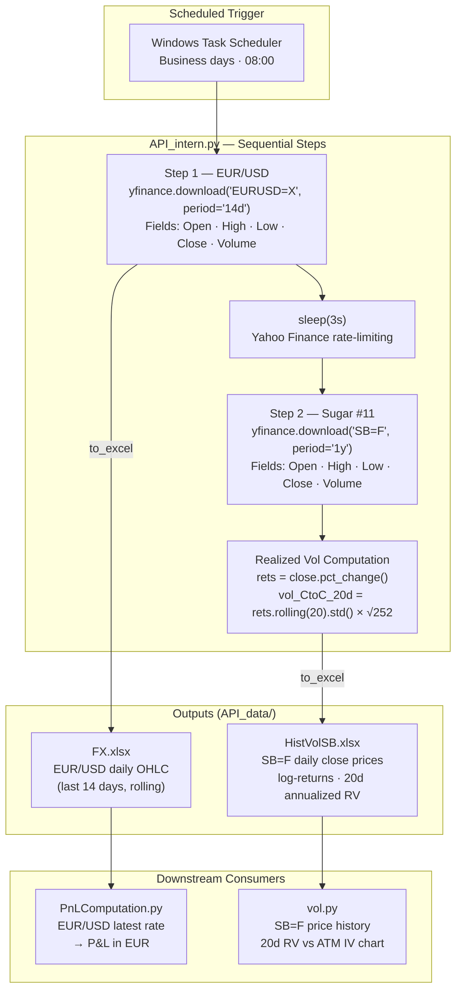
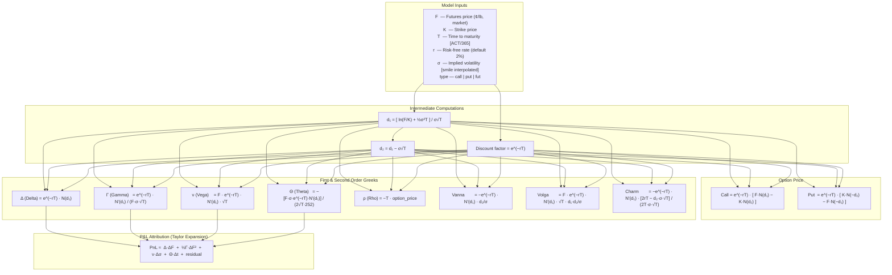
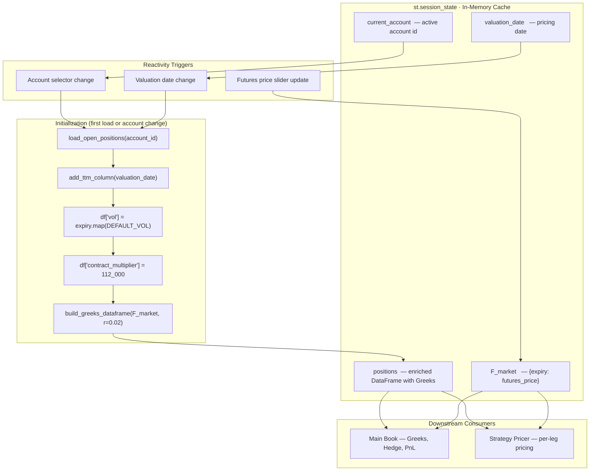
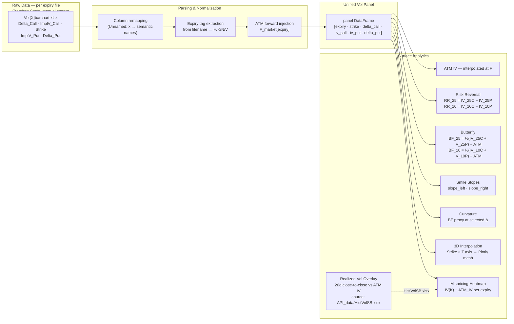
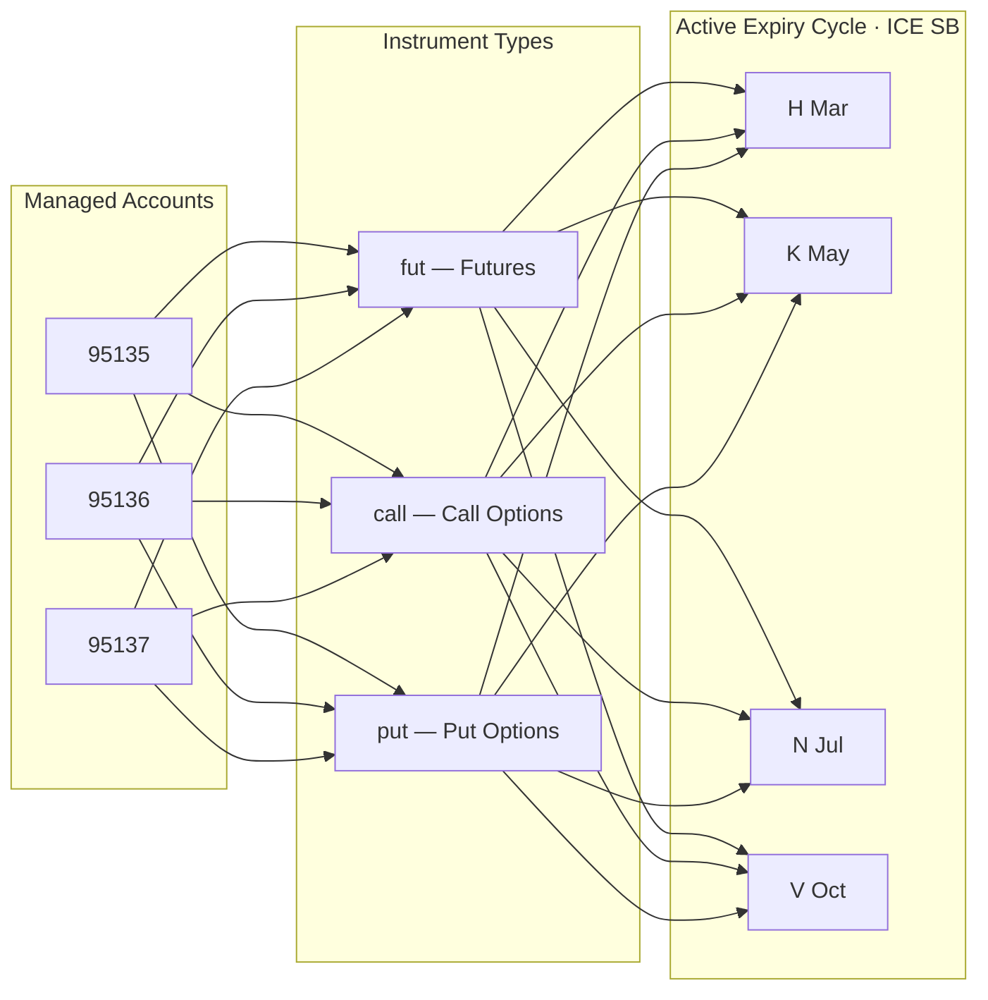

# System Architecture — PricerLB Sugar #11
**Version:** 1.0 | **Asset Class:** Agricultural Commodities — ICE Sugar #11 (SB) | **Model:** Black-76

---

## 1. Executive Overview

PricerLBSugar#11 is a single-dealer risk management and pricing platform for ICE Sugar #11 (SB) options and futures, covering three managed client accounts. It provides real-time Greeks aggregation, P&L attribution, implied volatility surface construction, and a multi-leg strategy pricer — all within a unified, session-aware dashboard.

The system is organized around a **thin orchestration layer** (`Cockpit.py`) that delegates all quantitative logic to four specialized modules. Market data flows from **two sources**: implied volatility smiles are ingested from **Barchart Cmdty** manual exports, while daily futures prices and EUR/USD rates are fetched automatically from **Yahoo Finance** via a scheduled `API_intern.py` pipeline. Data persistence relies on Excel workbooks, enabling lightweight deployment with no database infrastructure.

---

## 2. High-Level System Architecture

---

## 3. Data Pipeline

---

## 4. Market Data Pipeline — API_intern.py

---

## 5. Pricing Model — Black-76

---

## 6. Session State & Reactivity Model

---

## 7. Volatility Surface Construction

---

## 8. Contract & Expiry Reference

| Code | Month   | First-Notice Rule                              |
|------|---------|------------------------------------------------|
| H    | March   | Last business day of the preceding month       |
| K    | May     | Last business day of the preceding month       |
| N    | July    | Last business day of the preceding month       |
| V    | October | Last business day of the preceding month       |

**Contract specs:** SB · ICE Futures US (IFUS) · 112,000 lbs per lot · US cents / lb · Tick 0.01 ¢/lb · Tick value USD 11.20

**Coverage:** H26 (March 2026) through V34 (October 2034) — first-notice dates hardcoded in `EXPIRY_DATES`.

---

## 9. Module Responsibility Matrix

| Module | Responsibility | Key Functions |
|---|---|---|
| `Cockpit.py` | Orchestration, routing, session state, UI layout | Page dispatch · `st.session_state` management · market input widgets |
| `GreeksManagement.py` | Black-76 pricing, Greeks, hedge advisor, PnL explain | `build_greeks_dataframe` · `portfolio_delta_by_expiry` · `compute_pnl_explain` · `delta_hedge_action_by_expiry` |
| `PnLComputation.py` | Realized P&L, EUR conversion, performance metrics | `build_daily_pnl_series` · `compute_sharpe` · `compute_max_drawdown` · `compute_pnl_by_year` |
| `vol.py` | Vol surface construction, smile analytics, RV vs IV | `build_smile_panel_from_excels` · `compute_skew_metrics` · `plot_vol_surface` · `compute_vol_mispricing_map` |
| `SavingsManagement.py` | Excel I/O, account-level data access | `load_open_positions` · `save_open_positions` · `load_closed_positions` |
| `API_intern.py` | Scheduled market data ingestion (yfinance) | `download EURUSD=X → FX.xlsx` · `download SB=F → HistVolSB.xlsx` · `compute vol_CtoC_20d` |

---

## 10. Account & Portfolio Structure

---

## 11. Known Constraints & Design Decisions

| Area | Decision | Rationale |
|---|---|---|
| Persistence | Excel workbooks (no database) | Zero-infrastructure deployment · audit-friendly flat files |
| Pricing model | Black-76 with flat vol per expiry (default) | Industry standard for commodity options · smile loaded from Barchart when available |
| Vol source | Barchart Cmdty manual export (`.xlsx`) | No live IV API · vol data requires manual refresh |
| Market data | Yahoo Finance via `yfinance` (SB=F, EURUSD=X) | Free, automated daily feed for prices and realized vol |
| Vol interpolation | Linear interpolation across strikes within each expiry | Sufficient for risk monitoring · no-arbitrage constraints not enforced |
| RV computation | 20-day close-to-close, annualized (ACT/252) | Standard short-term realized vol benchmark vs ATM IV |
| Session state | `st.session_state` as in-memory cache | Avoids recomputing Greeks on every widget interaction |
| Deployment | `streamlit run Cockpit.py` — single process | Internal single-user tool · no concurrency requirements |
| Data scheduler | Windows Task Scheduler (`API_intern.py`) | Simple local automation · not portable to macOS/Linux |
| File paths | Dual-path (macOS / Windows) hardcoded | Multi-environment support · must be updated manually on new deployments |

---

*Source: `Cockpit.py` · `GreeksManagement.py` · `PnLComputation.py` · `vol.py` · `SavingsManagement.py` · `API_intern.py`*
